# Azure Icons for Mermaid Diagrams

Iconify JSON pack containing 625+ official Azure service icons for use with Mermaid `architecture-beta` diagrams rendered via [mermaid-cli](https://github.com/mermaid-js/mermaid-cli).

## Usage

```bash
npx @mermaid-js/mermaid-cli -i diagram.mmd -o output.png \
  --iconPacksNamesAndUrls "azure#https://raw.githubusercontent.com/DittmannAxel/azure-icons/main/icons.json" \
  -b white
```

Use the `azure:` prefix in your Mermaid diagrams:

```mermaid
architecture-beta
    service app(azure:app-services)[App Service]
    service db(azure:azure-cosmos-db)[Cosmos DB]
    app:R --> L:db
```



## Icon Categories

Icons are organized in the `icons/` folder by category: ai-machine-learning, analytics, app-services, compute, containers, databases, devops, identity, integration, iot, management-governance, monitor, networking, security, storage, web, and more.

## Verify Icon Names

```bash
curl -s "https://raw.githubusercontent.com/DittmannAxel/azure-icons/main/icons.json" | python3 -c "import json,sys; [print(k) for k in json.load(sys.stdin)['icons'] if 'SEARCH_TERM' in k]"
```

## Rebuild icons.json

After adding or updating SVGs in `icons/`, regenerate the pack:

```bash
python3 build-icons.py
```
